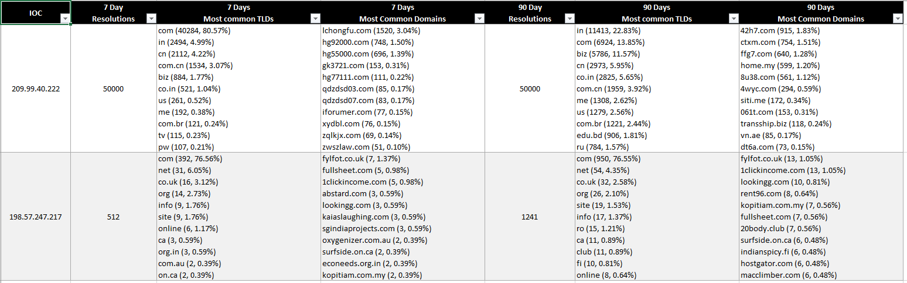

# Passive TLD Checker
Passive TLD Checker users passive DNS data to give an account of which domains are hosted on an IP in a period of time.
The script takes IPs and Periods and retrieves data regarding the most common TLDs on that IP in that period of time.
The script is based on DNSDB data by Farsight and requires an API key.

##### Typical usage example:
`farsight_standalone.py 209.99.40.222 198.57.247.217 -l 10000 -d 7 30 90`

##### Simple Output

##### Excel output

### Flags

- --path (-p): specifies the directory in which the excel file will be saved.

- --periods (-d): List of periods in days separated by space.

- --top_amount (-t): the number of TOP TLDs to display in the Excel spreadsheet.

- --limit (-l): Max resolutions to be returned by the DNSDB API.

- --excel (-e): The script will not save an excel file (only simple text output)

[ThreatSTOP](http://www.threatstop.com/)
